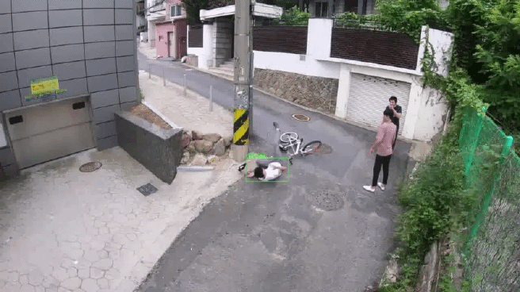
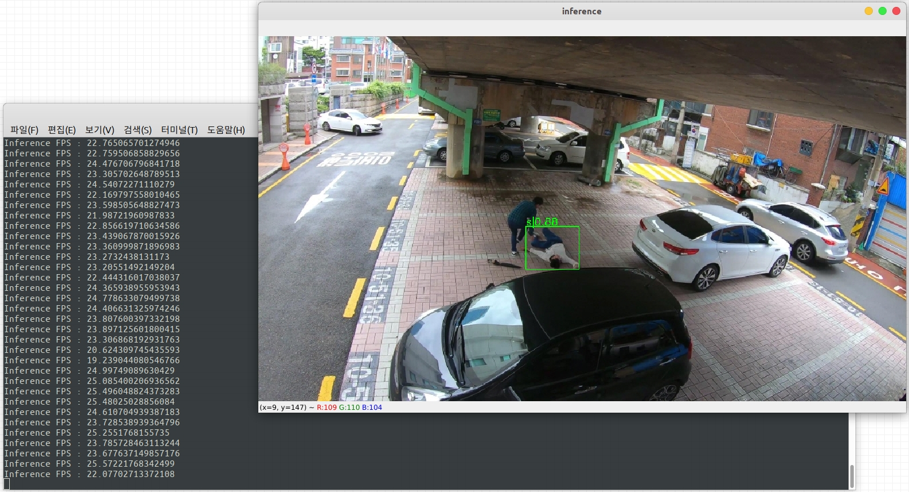

Detection and tracking for swooned person using NAS-FPN (Ver. 2.0)
========

Introduce
-----
This repo is the output of the [IITP AI Grand Challenge](http://www.ai-challenge.kr/). It was released under [Apache License 2.0](https://github.com/blackCmd/nas-fpn/blob/master/LICENSE), and anyone can use it freely within the scope of the license.



How to use
-------
1. Download this repo and build. (Build tutorial is [here](https://mmdetection.readthedocs.io/en/latest/get_started.html#installation).)
2. Make *"**./checkpoints**"* directory and download model below  ***./checkpoints**.*
3. run ```python ./demo.py```.
4. You can see result like below.



Model Zoo
-------
https://drive.google.com/file/d/1pbc1R4oIaKNTQ-R_kqx9QnBmziN9up6B/view?usp=sharing

(Download below **./checkpoints/**)

Reference
-----
[NAS-FPN](https://arxiv.org/abs/1904.07392)

[MMDetectoin](https://github.com/open-mmlab/mmdetection)


